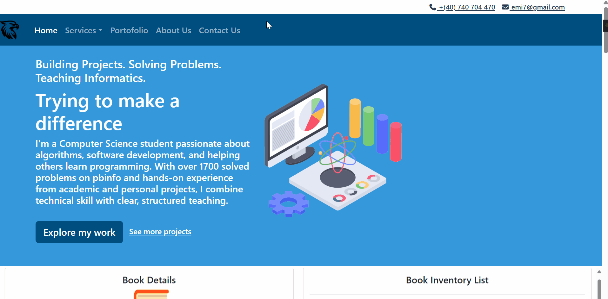

# Portfolio Presentation Site

A clean and responsive personal portfolio website showcasing projects, skills, and professional background. Built with HTML, CSS, and JavaScript, and styled with Bootstrap, the site features dedicated pages for services, contact information, and project highlights.

## Demo



## Overview

This repository contains a multi-page static website designed to present a professional portfolio. It includes an about page, a set of individual service pages, a general portfolio page, and a contact page, all linked through a consistent layout and navigation structure.

## Features

- Responsive design that adapts to desktop, tablet, and mobile screens
- Multi-page layout with dedicated sections for different services
- Consistent navigation and styling across all pages
- Icon support via Font Awesome
- Built on the Bootstrap framework for layout and components

## Pages

| Page | Description |
| --- | --- |
| `default.html` | Home / landing page |
| `about_us.html` | Information about the author or team |
| `portofolio.html` | Portfolio overview and project highlights |
| `contact_us.html` | Contact form and information |
| `web_development.html` | Web development service page |
| `web_designing.html` | Web design service page |
| `software_development.html` | Software development service page |
| `mobile_apps.html` | Mobile app development service page |
| `graphic_desgin.html` | Graphic design service page |
| `seo_services.html` | SEO services page |

## Tech Stack

- HTML5
- CSS3
- JavaScript
- Bootstrap

## Project Structure

```
Portofolio_Presentation_Site/
├── bootstrap/        Bootstrap framework files
├── css/               Custom stylesheets
├── fontawesome/       Font Awesome icon library
├── imgs/              Images and media assets
├── default.html       Home page
├── about_us.html
├── portofolio.html
├── contact_us.html
├── web_development.html
├── web_designing.html
├── software_development.html
├── mobile_apps.html
├── graphic_desgin.html
├── seo_services.html
└── README.md
```

## Getting Started

To run this project locally:

1. Clone the repository
   ```
   git clone https://github.com/emanuelco07/Portofolio_Presentation_Site.git
   ```
2. Navigate into the project folder
   ```
   cd Portofolio_Presentation_Site
   ```
3. Open `default.html` in a web browser, or serve the folder with a local development server (for example, the Live Server extension in VS Code).

No build steps or dependencies are required, as the site is built with static HTML, CSS, and JavaScript.

## License

This project is available for personal and educational use. Add a license file if you intend to distribute or reuse this code publicly.

## Contact

For questions or feedback, please use the contact page included in the site or reach out through GitHub.